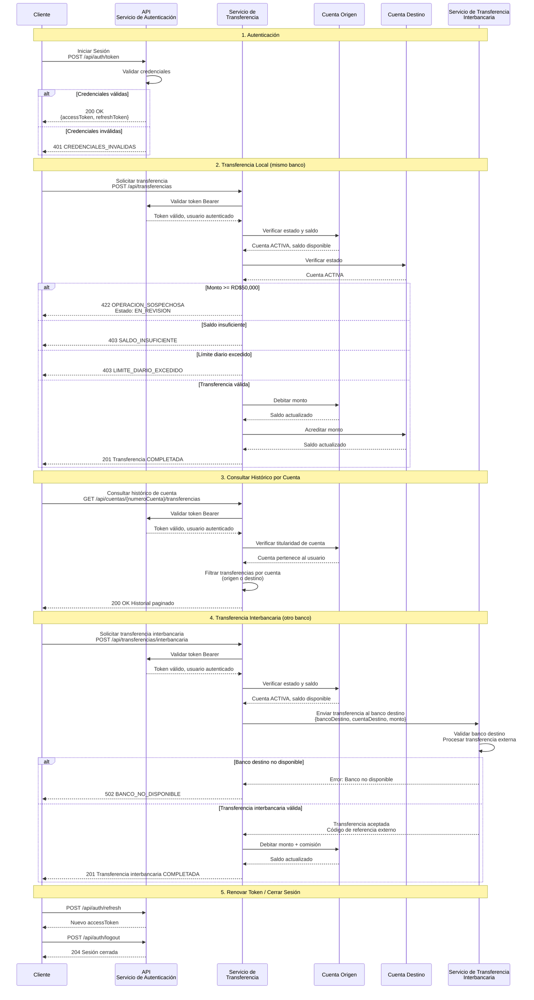
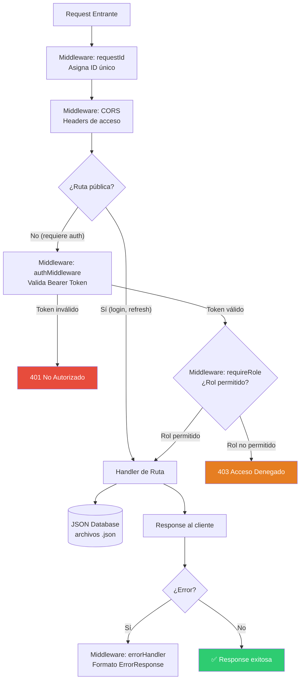

# Flujo de Autenticación y Roles — API Bancaria de Transferencias

## Diagrama de Flujo de la API

---

## Diagrama de Arquitectura de Seguridad

---

## Tabla de Roles y Permisos

| Endpoint | Método | CLIENTE | ADMIN_BANCO | AUDITOR | Público |
|----------|--------|:-------:|:-----------:|:-------:|:-------:|
| `/api/auth/token` | POST | — | — | — | ✅ |
| `/api/auth/refresh` | POST | — | — | — | ✅ |
| `/api/auth/logout` | POST | ✅ | ✅ | ✅ | — |
| `/api/clientes/me` | GET | ✅ | ✅ | ✅ | — |
| `/api/cuentas` | GET | ✅ | ✅ | ✅ | — |
| `/api/cuentas/{id}` | GET | ✅ | ✅ | ✅ | — |
| `/api/cuentas/{id}/transferencias` | GET | ✅ | ✅ | ✅ | — |
| `/api/beneficiarios` | GET | ✅ | ✅ | ✅ | — |
| `/api/beneficiarios` | POST | ✅ | ✅ | ✅ | — |
| `/api/beneficiarios/{id}` | PUT | ✅ | ✅ | ✅ | — |
| `/api/beneficiarios/{id}` | DELETE | ✅ | ✅ | ✅ | — |
| `/api/transferencias` | GET | ✅ | ✅ | ✅ | — |
| `/api/transferencias` | POST | ✅ | ✅ | ✅ | — |
| `/api/transferencias/interbancaria` | POST | ✅ | ✅ | ✅ | — |
| `/api/transferencias/{id}` | GET | ✅ | ✅ | ✅ | — |
| `/api/transferencias/{id}/comprobante` | GET | ✅ | ✅ | ✅ | — |
| `/api/admin/transferencias/sospechosas` | GET | ❌ | ✅ | ✅ | — |
| `/api/admin/transferencias/{id}/revision` | PATCH | ❌ | ✅ | ❌ | — |
| `/api/auditoria/eventos` | GET | ❌ | ❌ | ✅ | — |

### Descripción de Roles

| Rol | Descripción | Acceso |
|-----|-------------|--------|
| **CLIENTE** | Usuario bancario regular | Gestión de cuentas propias, beneficiarios, transferencias locales e interbancarias |
| **ADMIN_BANCO** | Administrador del banco | Todo lo de CLIENTE + revisar y aprobar/rechazar transferencias sospechosas |
| **AUDITOR** | Auditor del sistema | Todo lo de CLIENTE + ver transferencias sospechosas + consultar log de auditoría |
