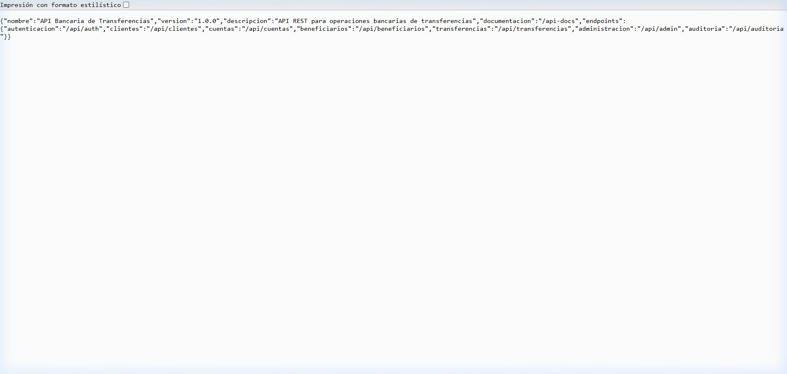
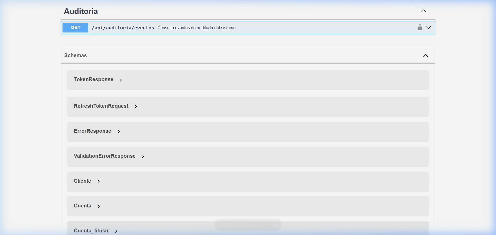
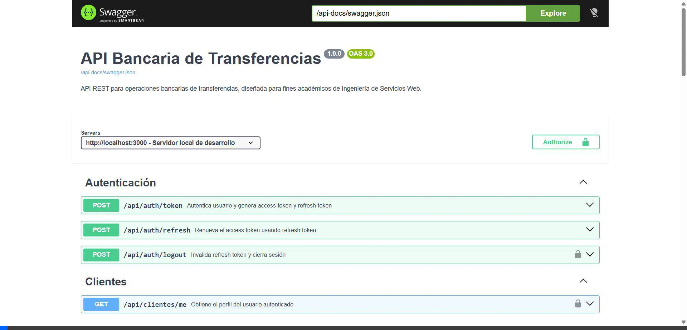

# API Bancaria de Transferencias — Walkthrough

## Resumen

Se implementó una API REST bancaria completa usando **Express 5** con archivos JSON como base de datos simulada, documentación **Swagger UI**, exportación en **Markdown**, y pruebas automatizadas.

---

## Estructura del Proyecto

```
proyecto segundo parcial/
├── index.js                          # Entry point
├── package.json                      # Dependencies & scripts
├── API_DOCUMENTATION.md              # Documentación en Markdown
├── src/
│   ├── swagger.js                    # Swagger UI setup
│   ├── swagger.json                  # OpenAPI 3.0.3 spec
│   ├── data/                         # JSON "database"
│   │   ├── usuarios.json
│   │   ├── clientes.json
│   │   ├── cuentas.json
│   │   ├── beneficiarios.json
│   │   ├── transferencias.json
│   │   └── auditoria.json
│   ├── helpers/
│   │   └── db.js                     # Read/write JSON helper
│   ├── middleware/
│   │   ├── auth.js                   # Token auth + session management
│   │   ├── roles.js                  # Role-based access control
│   │   ├── errorHandler.js           # Global error handler
│   │   └── requestId.js              # Request ID generator
│   └── routes/
│       ├── auth.routes.js            # Login, refresh, logout
│       ├── clientes.routes.js        # User profile
│       ├── cuentas.routes.js         # Accounts list/detail
│       ├── beneficiarios.routes.js   # CRUD beneficiaries
│       ├── transferencias.routes.js  # Transfers with business rules
│       ├── admin.routes.js           # Suspicious transfer review
│       └── auditoria.routes.js       # Audit event log
└── tests/
    ├── auth.test.js
    ├── cuentas.test.js
    ├── beneficiarios.test.js
    └── transferencias.test.js
```

---

## Pruebas Unitarias — 33/33 ✅

Todas las pruebas pasaron con **Jest + Supertest**:

| Suite | Tests | Estado |
|-------|-------|--------|
| auth.test.js | 5 | ✅ Passed |
| cuentas.test.js | 5 | ✅ Passed |
| beneficiarios.test.js | 5 | ✅ Passed |
| transferencias.test.js | 18 | ✅ Passed |
| **Total** | **33** | **✅ All Passed** |

Comando: `npm test`

---

## Pruebas en Navegador

### Endpoint raíz (`/`)


### Swagger UI (`/api-docs`)


### Grabación de verificación de Swagger UI


### Grabación de pruebas de endpoints en navegador


Se verificaron en Swagger UI:
- **POST `/api/auth/token`** → 200 OK con tokens generados
- **GET `/api/clientes/me`** → 200 OK con perfil de Juan Pérez
- **GET `/api/cuentas`** → 200 OK con listado de cuentas

---

## Cómo Usar

```bash
# Iniciar servidor
npm start

# Ejecutar tests
npm test
```

- **API:** http://localhost:3000
- **Swagger UI:** http://localhost:3000/api-docs
- **Documentación Markdown:** `API_DOCUMENTATION.md`

### Usuarios de prueba

| Usuario | Contraseña | Rol |
|---------|-----------|-----|
| cliente01 | ClaveSegura123! | CLIENTE |
| cliente02 | ClaveSegura456! | CLIENTE |
| admin01 | AdminSegura789! | ADMIN_BANCO |
| auditor01 | AuditorSegura321! | AUDITOR |
